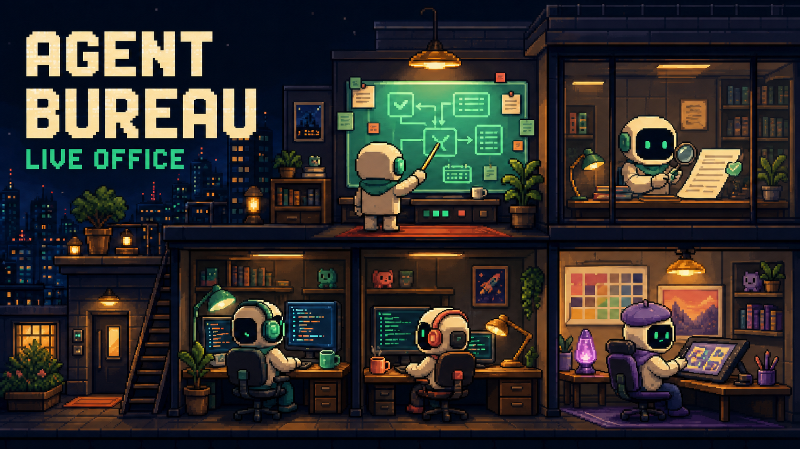

# Agent Bureau — Pixel Office



[Open the public demo shift](https://agent-bureau.vercel.app)

A read-only view of an orchestrator and a pool of specialized agents at work.
The interface shows roles, tasks, status, model, reasoning effort, elapsed time,
and verification results, but it never receives prompts, file contents,
transcripts, or tool output.

The public web version runs a demo shift. The local version can connect to the
collector and show live Codex events from this computer.

## What works today

- a pixel-art office based on the approved reference, with eight separate role
  sprites animated from live status;
- clickable `orchestrator → agent` routes and task packets;
- an assignment inspector with source, recipient, task ID, status, and summary;
- a dynamic pool with an orchestrator, developer, designer, researcher,
  copywriter, verifier, marketer, and illustrator;
- a dedicated themed office for each permanent role; additional live agents
  remain available in the digital annex and Team roster, while unknown roles
  receive a deterministic fallback sprite;
- a readable `TEAM` popover and a separate, always-visible `ADD AGENT` action;
- a profile builder with a custom name and specialty, eight offices, eight
  avatars, an arbitrary model ID, a reasoning dropdown, a runtime connection
  guide, and a required system prompt; profiles appear without React changes;
- an English interface and social image, an upward-gaze hover/focus response,
  corrected Designer sprite transparency, and a cozy pixel-house tab icon;
- a safe local collector with an explicit field allowlist;
- independent verification with no more than two revision rounds in the Agent
  Bureau skill;
- Markdown memory for decisions, lessons, and research reports.

## Architecture

```text
Codex hooks / external events
              │
              ▼
local collector :7331 ──► normalized snapshot
                                  │
                                  ▼
                    Pixel Office :3000 / Vercel demo
```

## Fastest start on macOS

Double-click `start-office.command`, then open:

```text
http://localhost:3000
```

Keep the Terminal window open. Press `Control-C` to stop the office.

If Node.js is already installed normally:

```bash
npm install
npm run office
```

The `office` command starts both:

- the interface on `127.0.0.1:3000`;
- the event collector on `127.0.0.1:7331`.

Both addresses are available only on this computer. The public Vercel site
uses a read-only browser bridge to the same loopback collector. When this
computer and the observer are running, `https://agent-bureau.vercel.app` shows
the live shift; when they are not, it safely falls back to the demo snapshot.
Telemetry remains on this computer: Vercel does not receive or store it.
The first production visit may ask for loopback/local-network access; allow it
for this exact site if you want the live view.

## Connecting live Codex events

The project already includes `.codex/config.toml` and the safe
`scripts/codex-hook.mjs` bridge. To connect it for the first time:

1. Start Pixel Office. A trusted hook also attempts to start only the collector
   automatically if it is not already running.
2. Open a new Codex task from this repository.
3. Open `/hooks` and trust the project definitions.
4. Start a subagent or tool; the office updates automatically.

Codex asks for trust again when a hook definition changes. This is expected
protection. The hook never blocks, approves, or automatically continues work; it
only sends a reduced event to the local collector. For `Stop` and
`SubagentStop`, the bridge returns the neutral `{"continue":true}` response.

If the collector is off, Codex continues normally. The interface shows the demo
shift until live agents appear.

The production origin is allowed to read `GET /api/state` but cannot post
events. Additional self-hosted UI origins can be added explicitly with the
comma-separated `BUREAU_READ_ONLY_ORIGINS` environment variable. Localhost UI
origins retain read/write access; CLI and hook traffic has no browser origin.

## Agent Bureau events

An external orchestrator can send its own statuses and explicit assignments.
The bundled CLI avoids hand-writing JSON and publishes only allowlisted fields:

```bash
node scripts/bureauctl.mjs emit \
  --type task.assigned \
  --task-id TASK-42 \
  --from-agent-id orchestrator \
  --to-agent-id coder-1 \
  --name Developer \
  --role coder \
  --title "Add authentication" \
  --summary "Build middleware and tests"
```

The raw HTTP contract remains available:

```bash
curl --request POST \
  --header 'Content-Type: application/json' \
  --data '{
    "type": "task.assigned",
    "assignmentId": "TASK-42:coder-1",
    "fromAgentId": "orchestrator",
    "agentId": "coder-1",
    "taskId": "TASK-42",
    "name": "Developer",
    "role": "coder",
    "task": "Add authentication",
    "model": "luna",
    "effort": "medium",
    "summary": "Build middleware and tests"
  }' \
  http://127.0.0.1:7331/api/events
```

Supported states:

```text
idle · planning · working · reviewing · revision · blocked · done
```

Primary endpoints:

```text
GET  /api/health
GET  /api/state
POST /api/events
```

The collector retains at most 50 recent assignments and advances their lifecycle
from `assigned` to `done`, `blocked`, or `revision`.

The collector accepts only allowlisted fields. Events are limited to 32 KiB;
secrets and path-like strings are additionally redacted.

## Local data

History is stored in the ignored `.bureau/` directory:

```text
.bureau/events.jsonl  — append-only event stream
.bureau/state.json    — latest office snapshot
```

Nothing is uploaded to the cloud automatically. The public UI reads the local
snapshot from the browser through an exact-origin, read-only CORS rule.

Profiles created through `ADD AGENT` are stored separately in the current
browser's `localStorage` under `agent-bureau.agent-profiles.v2`. Records in the
legacy `agent-bureau.custom-agents.v1` format migrate to v2 only after a
successful write. The system prompt never enters the collector, task summary,
or HTML cards. A created profile can be deleted from its inspector.

## Bring your own runtime and model

The builder is not tied to one provider. Its starter catalog includes:

- Codex / OpenAI;
- Cursor;
- Claude Code;
- any OpenAI-compatible endpoint, including Ollama, vLLM, OpenRouter, DeepSeek,
  Qwen, or GLM;
- a custom CLI, SDK, or local bridge.

Model ID remains an arbitrary safe string, so the interface is not limited by a
stale model allowlist. Reasoning is selected from a readable dropdown covering
provider default, low, medium, high, xhigh, max, and ultra. An API-compatible
runtime can include an HTTP(S) endpoint. Instead of an API key, the profile
stores only an environment variable name such as `OPENAI_API_KEY`; only a
trusted local adapter reads the secret value.

The provider catalog lives in
[`config/runtime-providers.json`](config/runtime-providers.json), and the portable
profile schema lives in
[`config/agent-profile.schema.json`](config/agent-profile.schema.json). Add a
builder option by adding a JSON record with `id`, `label`, `adapterId`,
`adapterMode`, a short `setupHint`, and field policies. Existing catalogs that
omit `setupHint` receive a safe generic local-adapter explanation. Never put
shell commands in the catalog; executable adapter code stays local and is
reviewed separately.

Important: the public Vercel site creates a **configuration**; it does not start
a process on the user's computer. A local runtime adapter performs the real
start, model availability check, and normalized telemetry delivery. The model
requested in a profile and the model confirmed by a live event are deliberately
shown as separate facts. The extension contract is documented in
[`docs/RUNTIME_ADAPTERS.md`](docs/RUNTIME_ADAPTERS.md).

## Experimental limitations

- The hook applies only to Codex tasks opened from this repository.
- Live visualization works only while the local Pixel Office is running.
- Tool hooks do not include `agent_id`, so their telemetry belongs to the
  orchestrator. Exact subagent roles and tasks come from `SubagentStart`,
  `SubagentStop`, or Bureau events.
- Hosted tools and some specialized tools may not emit tool events.

The Hooks schema follows the current
[official Codex documentation](https://learn.chatgpt.com/docs/hooks.md).

## Agent Bureau skill

The reusable skill source lives in `skills/agent-bureau`. It defines roles,
assignment packets, parallel waves, independent verification, a two-revision
limit, and project-memory rules.

Research is assigned to the `Cursor Grok 4.5 High Fast` profile in Cursor Ask
mode without project changes. The local adapter first checks for the exact
profile, then compares the actual model from the start event. Silent model
substitution is forbidden.

Readiness check:

```bash
./researcher.command
```

Run after installing and authenticating Cursor Agent CLI:

```bash
./researcher.command \
  --task-id cursor-grok-profile \
  --task "Verify the current Grok 4.5 profile in Cursor using official sources"
```

The report is saved to `docs/research/<task-id>.md` and sent to Pixel Office as
an artifact for verification. Defaults are two search rounds, at most 12 search
queries, a hard limit of 20 tool calls, and a 12-minute timeout.
